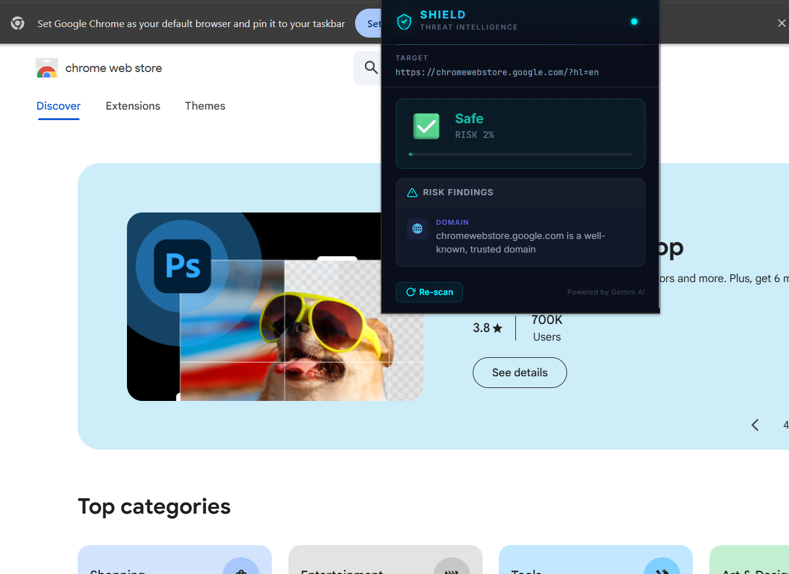

# Shield — AI-Powered Phishing Link Detector

## Problem Statement
Phishing attacks remain one of the most common and effective cyber threats, tricking users into visiting malicious websites that steal credentials, financial data, and personal information. Traditional blocklist-based approaches can't keep up with the volume of new phishing domains created every day, leaving everyday internet users vulnerable.

## Project Description
**Shield** is a Chrome extension backed by a serverless AI API that detects phishing URLs in real time as users browse the web. Instead of relying on static blocklists, Shield sends every new URL to **Google's Gemini AI** for intelligent, context-aware analysis — evaluating domain reputation, URL structure, typosquatting patterns, brand impersonation, suspicious TLDs, and behavioral signals.

### Key Features
- 🛡️ **Real-time Protection** — Automatically scans every page you visit in the background; no manual action needed.
- 🤖 **Gemini AI Analysis** — Uses `gemini-3.1-flash` to evaluate URLs across four risk categories: Security, Domain, URL, and Behavior.
- 🚨 **In-page Warning Banners** — Injects a highly visible warning banner on suspicious (≥ 40% risk) and dangerous (≥ 70% risk) websites.
- 🔑 **Password Entry Alerts** — Detects password fields on flagged sites and warns users before they type credentials.
- ⚡ **Trusted Domain Bypass** — Skips API calls entirely for well-known domains (Google, GitHub, Amazon, etc.) for instant results.
- 🗄️ **Smart Caching** — Caches analysis results per domain (1-hour TTL, 500-entry LRU) to minimize API calls and latency.
- 📊 **Threat Meter UI** — A polished cybersecurity-themed popup showing risk score, threat level, summary, and categorized findings.
- 🔄 **Re-scan on Demand** — One-click re-scan button to force a fresh analysis of the current page.
- ☁️ **Serverless Backend** — Deployed on Vercel for zero-maintenance, globally distributed hosting.

---

## Google AI Usage
### Tools / Models Used
- **Google Gemini API** — Model: `gemini-3.1-flash`
- **Google AI Python SDK** (`google-genai`)

### How Google AI Was Used
The backend sends each URL to the **Gemini 3.1 Flash** model with a cybersecurity-expert system prompt. Gemini analyzes the URL for phishing indicators including:

1. **Typosquatting & brand impersonation** — Detects look-alike domains mimicking trusted brands.
2. **Suspicious TLDs & URL structure** — Flags unusual top-level domains, IP-based URLs, and URL shorteners.
3. **Phishing keywords** — Identifies common social-engineering patterns in the URL.
4. **Behavioral signals** — Assesses overall risk based on combined signals.

Gemini returns a structured JSON response with a probability score (0.0–1.0), a prediction (`phishing` / `legitimate`), a one-line summary, and categorized risk findings — all rendered directly in the extension popup and in-page banner.

The integration includes **retry logic with exponential backoff** for rate-limit handling (`429` / `RESOURCE_EXHAUSTED`), ensuring reliability under heavy use.

---

## Proof of Google AI Usage
Attach screenshots in a `/proof` folder:


---

## Screenshots
Add project screenshots:

  


---

## Demo Video
Upload your demo video to Google Drive and paste the shareable link here (max 3 minutes).
[Watch Demo](#)

---

## Tech Stack

| Layer | Technology |
|-------|-----------|
| AI Model | Google Gemini 3.1 Flash |
| Backend | Python, FastAPI, google-genai SDK |
| Deployment | Vercel (Serverless Python) |
| Extension | Chrome Extension (Manifest V3) |
| Frontend | HTML, CSS, JavaScript |
| Fonts | Inter, JetBrains Mono (Google Fonts) |

---

## Project Structure

```
phishing-link-detector/
├── backend/
│   ├── api/
│   │   └── index.py            # Vercel serverless entry point
│   ├── main.py                 # FastAPI app — Gemini analysis, caching, endpoints
│   ├── requirements.txt        # Python dependencies
│   ├── vercel.json             # Vercel build & routing configuration
│   ├── .env.example            # Environment variable template
│   └── .gitignore
├── extension/
│   ├── manifest.json           # Chrome Extension Manifest V3
│   ├── background.js           # Service worker — auto-scans tabs on navigation
│   ├── content.js              # Content script — warning banners & password alerts
│   ├── popup.html              # Extension popup UI
│   ├── popup.js                # Popup logic — fetches results, renders threat card
│   ├── config.js               # API base URL configuration
│   └── styles.css              # Cybersecurity-themed dark UI styles
├── README.md
└── LICENSE                     # MIT License
```

---

## Installation Steps

### Prerequisites
- **Python 3.9+** and **pip**
- A **Google Gemini API key** — get one free at [aistudio.google.com/apikey](https://aistudio.google.com/apikey)
- **Google Chrome** or any Chromium-based browser

### 1. Clone the Repository
```bash
git clone https://github.com/zeusenpai/phishing-link-detector.git
cd phishing-link-detector
```

### 2. Set Up the Backend (Local Development)
```bash
cd backend

# Create and activate a virtual environment
python -m venv venv
venv\Scripts\activate        # Windows
# source venv/bin/activate   # macOS / Linux

# Install dependencies
pip install -r requirements.txt

# Configure your API key
copy .env.example .env
# Edit .env and replace 'your_api_key_here' with your actual Gemini API key

# Start the backend server
uvicorn main:app --reload
```
The API will be available at `http://127.0.0.1:8000`.

### 3. Load the Chrome Extension
1. Open Chrome and navigate to `chrome://extensions/`
2. Enable **Developer mode** (toggle in the top-right corner)
3. Click **Load unpacked** and select the `extension/` folder
4. The Shield icon will appear in your toolbar

### 4. Connect Extension to Backend
Edit `extension/config.js` and set `API_BASE_URL` to your backend URL:
```js
// For local development:
const API_BASE_URL = "http://127.0.0.1:8000";

// For Vercel deployment:
// const API_BASE_URL = "https://your-project.vercel.app";
```

### 5. Deploy to Vercel (Optional)
```bash
cd backend
npx -y vercel --prod
```
Set the `GEMINI_API_KEY` environment variable in your Vercel project settings, then update `config.js` with the deployed URL.

---

## API Endpoints

| Method | Endpoint | Description |
|--------|----------|-------------|
| `GET` | `/` | Service info and available endpoints |
| `POST` | `/predict` | Analyze a URL for phishing (`{ "url": "..." }`) |
| `GET` | `/health` | Health check — model info, API key status, cache size |

---

## How It Works

```
┌─────────────┐    tab navigation    ┌───────────────┐     POST /predict     ┌──────────────┐
│   Browser    │ ──────────────────▶  │   background  │ ──────────────────▶   │   FastAPI     │
│   (Chrome)   │                      │   .js worker  │                       │   Backend     │
└─────────────┘                      └───────────────┘                       └──────┬───────┘
       ▲                                    │                                       │
       │            SHOW_WARNING            │                                       ▼
       │◀───────────────────────────────────┘                               ┌──────────────┐
       │                                                                    │  Gemini 3.1  │
┌──────┴───────┐                                                            │    Flash     │
│  content.js  │  ◀─── PASSWORD_ALERT (if risk ≥ 70%)                      └──────────────┘
│  (banners)   │
└──────────────┘
```

1. **User navigates** to a page → `background.js` fires `analyzeUrl()`.
2. The backend checks **trusted domains** → **cache** → calls **Gemini AI** if needed.
3. Results are stored in `chrome.storage.local` and sent to `content.js`.
4. `content.js` renders a **warning banner** for suspicious/dangerous sites.
5. If the user types into a **password field** on a dangerous site, an alert is triggered.
6. The **popup UI** displays the full threat analysis on demand.

---

## License
This project is licensed under the **MIT License** — see [LICENSE](./LICENSE) for details.
